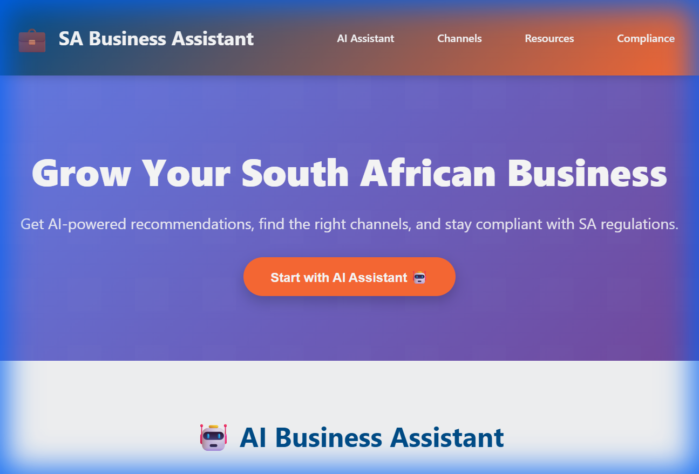

# 🇿🇦 Small Business Assistant



A comprehensive web platform designed to help South African entrepreneurs start, grow, and maintain compliant businesses. Features AI-powered recommendations, curated resources, and regulatory compliance guides.

🔗 **Live Demo:** [Launch App](https://raphasha27.github.io/small-business-assistant)

---

## ✨ Features

### 🤖 AI Business Assistant
- **Intelligent Q&A**: Ask questions about business registration, funding, tax compliance, and more
- **Context-Aware Responses**: Tailored answers specific to South African business landscape
- **Quick Actions**: Pre-defined queries for common questions

### 📢 Marketing & Sales Channels
Curated list of effective channels for SA businesses:
- **E-Commerce Platforms**: Takealot, BidorBuy, Shopify, WooCommerce
- **Social Media**: Facebook, Instagram, TikTok, LinkedIn for Business
- **Local Listings**: Google My Business, HelloPeter, Snupit
- **Digital Advertising**: Google Ads, Facebook Ads, Microsoft Advertising

### 📚 Comprehensive Resources
Direct links to essential SA business resources:
- **Government Portals**: CIPC, SARS, Department of Labour, dtic
- **Funding Agencies**: SEDA, NEF, IDC, Business Partners
- **Business Networks**: SACCI, SME SA, BWA, Silicon Cape
- **Business Tools**: Sage, Xero, Canva, Mailchimp

### 🛠️ Business Tools (NEW)
Essential tools to kickstart your venture:
- **🎯 Business Name Generator**: Get creative name ideas instantly
- **💰 Startup Cost Calculator**: Estimate registration, rent, and marketing costs
- **📄 Document Templates**: Download free Business Plans, Invoices, and Contracts
- **📈 Growth Tracker**: Visual chart to track your monthly revenue revenue

### ❓ FAQ & Support
- Quick answers to common questions about:
  - Business Registration Costs
  - Business Banking Requirements
  - VAT Registration
  - Funding without Collateral

### ✅ Compliance Checklist
Interactive checklists for:
- Company Registration (CIPC)
- Tax Registration (SARS, VAT, PAYE)
- Labour Compliance (UIF, COID)
- Other Requirements (Licenses, B-BBEE, Insurance)

---

## 🚀 Getting Started

### Installation

1. Clone the repository:
   ```bash
   git clone https://github.com/Raphasha27/small-business-assistant.git
   ```

2. Navigate to the project directory:
   ```bash
   cd small-business-assistant
   ```

3. Open `index.html` in your browser:
   ```bash
   # On Windows
   start index.html
   
   # On Mac/Linux
   open index.html
   ```

Or simply double-click `index.html` to run locally!

---

## 💡 How to Use

1. **Ask the AI Assistant**: Type your business questions in the chat interface
2. **Explore Channels**: Browse marketing and sales platforms suitable for your business
3. **Access Resources**: Click on curated links to government portals, funding agencies, and tools
4. **Track Compliance**: Use the interactive checklist to ensure you meet all regulatory requirements

---

## 🛠️ Technology Stack

- **Frontend**: HTML5, CSS3 (Vanilla)
- **Interactivity**: JavaScript (ES6+)
- **Design**: Custom CSS with vibrant SA-inspired color palette
- **AI Logic**: Rule-based keyword matching with comprehensive knowledge base
- **Storage**: LocalStorage for checklist progress

---

## 📸 Screenshots

### AI Assistant


### Marketing Channels


### Resources Directory


### Compliance Checklist


---

## 🤝 Contributing

Contributions are welcome! Here's how you can help:

1. Fork the repository
2. Create a feature branch (`git checkout -b feature/AmazingFeature`)
3. Commit your changes (`git commit -m 'Add AmazingFeature'`)
4. Push to the branch (`git push origin feature/AmazingFeature`)
5. Open a Pull Request

**Contribution Ideas**:
- Add more AI knowledge topics
- Update resource links
- Improve mobile responsiveness
- Add multilingual support (Afrikaans, Zulu, Xhosa)

---

## 📝 License

This project is licensed under the MIT License - see the [LICENSE](LICENSE) file for details.

---

## 🙏 Acknowledgments

- **CIPC** - For business registration standards
- **SARS** - For tax compliance guidelines
- **SEDA** - For SME development resources
- South African entrepreneurial community for inspiration

---

## 📧 Contact

**Raphasha27**
- GitHub: [@Raphasha27](https://github.com/Raphasha27)
- Project Link: [https://github.com/Raphasha27/small-business-assistant](https://github.com/Raphasha27/small-business-assistant)

---

## 🚀 Roadmap

- [ ] Integrate live AI (ChatGPT/Gemini API)
- [ ] Add business plan generator
- [ ] Implement funding application tracker
- [ ] Create printable compliance PDF reports
- [ ] Add email notifications for regulatory deadlines
- [ ] Build mobile app (React Native)

---

**Empowering South African Entrepreneurs, One Business at a Time** 🇿🇦💼
